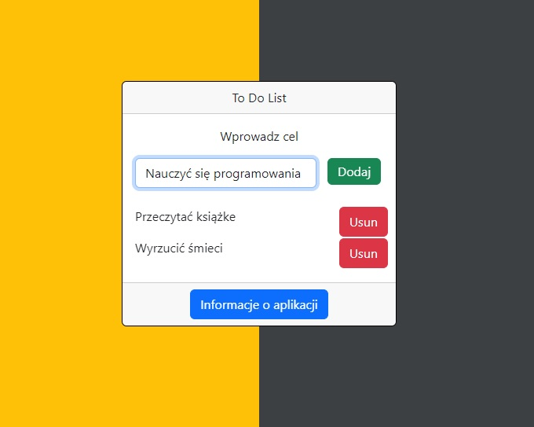

# :desktop_computer: ToDoList

The application allows the user to save tasks entered by them in the local memory and presents them in the form of a list, which facilitates the organization of daily duties. The data is saved in the local memory of the browser, ensuring easy access and the ability to edit the entered information.

## :framed_picture: Screenshots

## :joystick: Demo

https://kamilkeder.github.io/ToDoList/

## :e-mail: Feedback

If you have any feedback, please reach out to me at kontaktkkeder@gmail.com
